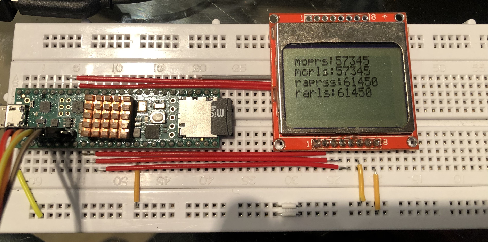

# KeyMapper

The idea is to emulate to some extent the functionality that the [QMK firmware](https://github.com/qmk/qmk_firmware) offers but on normal keyboards.
This is to allow one to bring your layout around without the keyboard.
You'll just need an USB keyboard and to plug this thing in the middle.
Then maybe perhaps somehow I'll end up arriving to something like Cryham's [KC4](https://github.com/cryham/kc4/)

The layouts are configured in the config folder, to insert in the Teensy before running.
Layer0 defines the keys for the successive layers, the other layers contain the remapped keys.

Right now I'm using the Nokia 5110 Display, but will use the ili9341 as it allows to use the hardware SPI so godspeed.

# TODOs

+ ~~Display~~
+ Keyboard-controlled Display menu
+ Key Macros
+ Tap/hold keys
+ Mouse Settings
+ Host mount microSD to modify 
+ Copy config to internal storage and use that if sd card is not present (i.e. sd card is used for "reprogramming")

# You probably also need this:

[Teensy pinout](https://www.pjrc.com/teensy/pinout.html#:~:text=Teensy%204.1)

[Nokia 5110 Display](https://thecustomizewindows.com/wp-content/uploads/2017/06/Nokia-5110-Arduino-Wiring-Technical-Details-Basic-Arduino-LCD.jpg)

[Ili9341 pinout](https://thesolaruniverse.files.wordpress.com/2021/03/092_figure_04_96_dpi.png)

# First picture of the thing

# Latest changes

- Added layer 4 with display keys, no menu yet
- Added simple display (the Nokia 5110 one) to start building a structure, while the ILI9341 arrives
- Waiting for the EEPROM as well, so that we can save the config file in flash instead, possibly even multiple layouts. Will use the internal one in the meanwhile.
- Need to find a distributor in Europe that presoldery's PSRAM and flash as well, or learn to solder SMD perhaps, if i can get those chips shipped here
